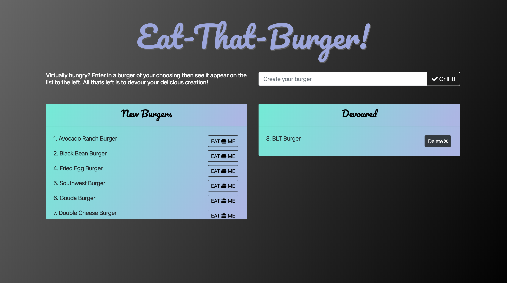

# Eat the Burger

This is an app that utilises:
* Javascript
* HTML
* CSS
* Express
* Node
* Handlebars (yuck)
* Mysql

---

## [Link to Heroku](https://mighty-lake-47636.herokuapp.com/)

---

The user can enter in a burger and it will be added to the mySQL tables and displayed on a list of uneaten burgers. Then they can click the button to eat the burger which will change the value of whether its eaten or not and move it to the opposite list. Theres also an option to delete the burger from the list if you're just sick of looking at it.

